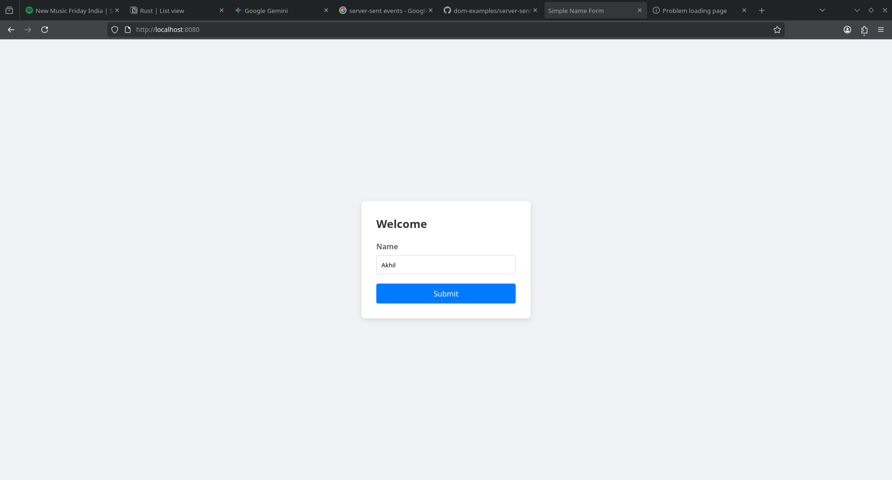
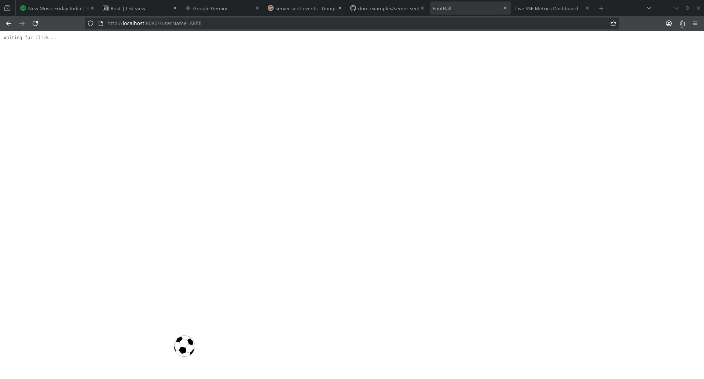
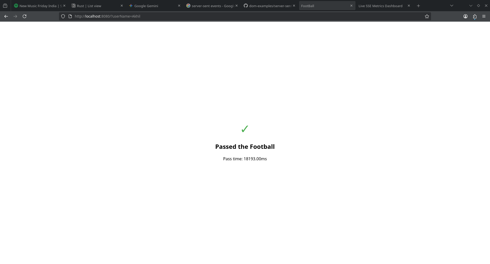
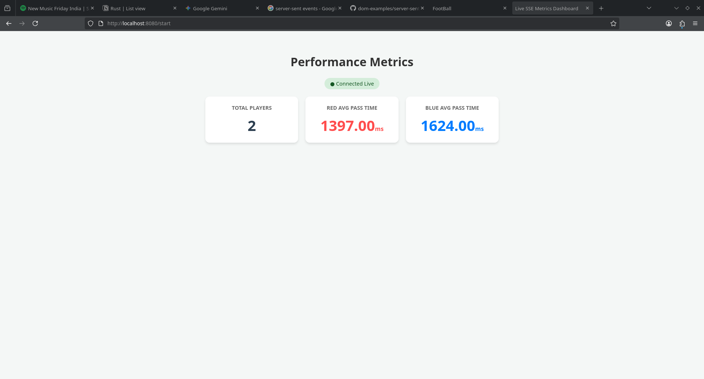

# Learn Async programming by playing Soccer - Pyconf Hyd 2026

> How boring it is to learn async programming without any reason. Therefore I've created a small soccer game for PyConf Hyd 2026 audience to play and learn async programming.

# What is the Game ?
Objective of the game make fast passes as early as possible.

There will be Red and Blue teams and each member in the audience will be alloted to one of the teams after scanning a QR code and registering with name.

After the match starts, each person should pass the football by tapping on it as fast as possible. After tapping, the ball gets passed to another team member  and it gets repeated.

A scoreboard is also present to observe each team's perfomance that refreshes every second

**Team with lowest average pass time wins the match.**

# What will be learnt ?
- Audience will learn how to build this complex game from scratch using async / await primitives without any web frameworks.
- Internals of Async programming.
- They will learn how easy it's to comprehend and write http server from scratch.
- They will learn about server side events and how to send data from server to client.
- They will learn how to avoid race conditions with Locking.

# Setup
- Only >=python3.12 is required and whole game is written in single file
- Simply run `python3 soccer.py`
- Register user by going to `localhost:8080`
- Start the game and view scoreboard by going to `localhost:8080/start`

# Built with ❤️ for PyConf Hyd 2026